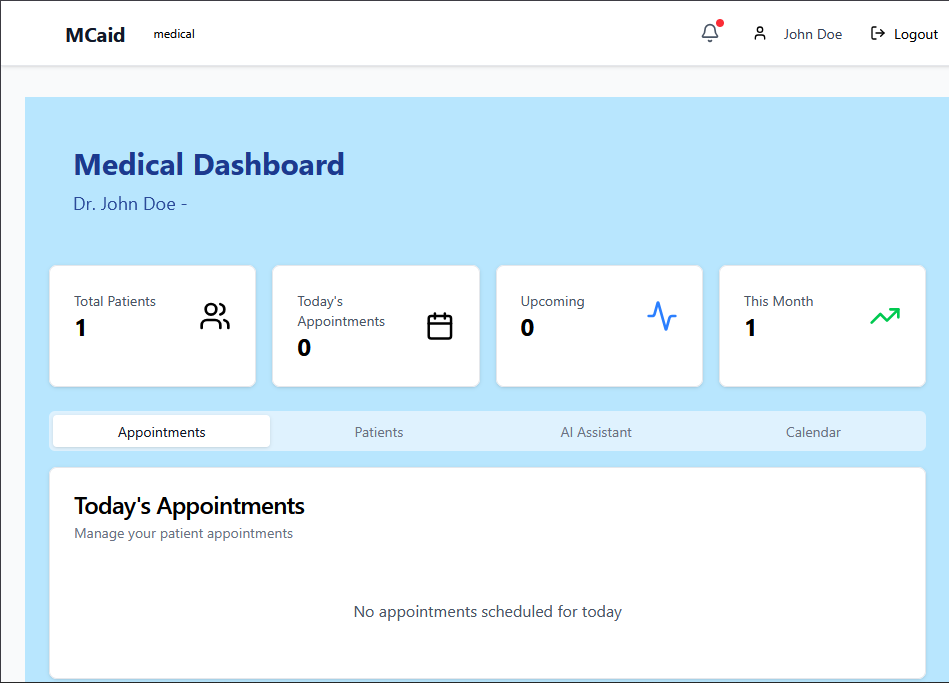
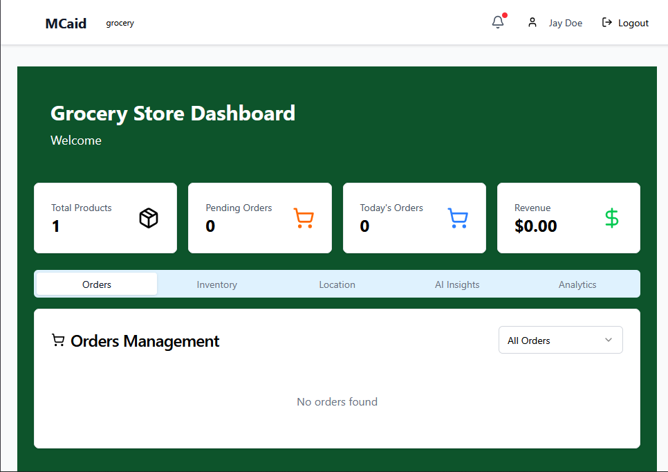

# MCaid - Maternal Care Platform 🏥👶

A comprehensive full-stack MERN (MongoDB, Express.js, React.js, Node.js) application designed to provide maternal healthcare monitoring, appointment management, grocery services, and AI-powered health assistance for pregnant mothers.

## Project Description

MCaid is a health monitoring platform specifically designed for pregnant mothers. It combines healthcare delivery, marketplace services, and AI-powered assistance to provide comprehensive support throughout pregnancy. The platform addresses real-world challenges faced by expectant mothers including:

- **Healthcare Access**: Easy appointment booking with healthcare providers
- **Health Monitoring**: Track pregnancy records, medications, and symptoms
- **Nutrition Support**: AI-powered meal planning and grocery marketplace
- **Real-time Communication**: Chat with healthcare providers and support community
- **Admin Management**: Dashboard for healthcare facility management and user verification

## Key Features

### 👤 User Features
- **Authentication & Authorization**: Secure login with role-based access control
- **Appointment Management**: Schedule and track medical appointments with healthcare providers
- **Health Records**: Maintain pregnancy records, medications, and health metrics
- **Symptom Tracking**: Monitor and log pregnancy symptoms
- **AI Meal Planner**: AI-powered nutrition recommendations and meal planning
- **Grocery Marketplace**: Browse and order groceries with local store integration
- **Order Tracking**: Real-time tracking of marketplace orders
- **Store Locator**: Find nearby stores using map integration
- **Real-time Chat**: Direct communication with healthcare providers
- **Notifications**: Real-time notifications for appointments and orders

### 👨‍⚕️ Healthcare Provider Features
- **Patient Management**: View and manage patient list
- **Appointment Calendar**: Schedule and manage appointments
- **Patient Records**: Access comprehensive patient health history
- **Document Verification**: Verify patient documents for credibility

### 👨‍💼 Admin Features
- **User Management**: Manage all platform users
- **Verification Management**: Approve/reject healthcare provider verification
- **Analytics Dashboard**: View platform statistics and trends
- **System Configuration**: Manage platform settings and policies

## Technology Stack

### Backend
- **Runtime**: Node.js
- **Framework**: Express.js 5.x
- **Database**: MongoDB with Mongoose ODM
- **Authentication**: JWT (JSON Web Tokens)
- **Real-time Features**: Socket.io
- **File Upload**: Cloudinary
- **Email Service**: Nodemailer
- **AI Integration**: Hugging Face Inference API
- **Payment Processing**: Stripe
- **SMS Service**: Twilio
- **Security**: Helmet.js, bcryptjs, express-rate-limit

### Frontend
- **Framework**: React.js 19.x
- **UI Library**: Radix UI + Tailwind CSS
- **State Management**: Redux Toolkit
- **Routing**: React Router v7
- **HTTP Client**: Axios
- **Data Fetching**: TanStack React Query
- **Real-time**: Socket.io Client
- **Charts/Maps**: Recharts, Leaflet, React Leaflet
- **Icons**: Lucide React

### Development Tools
- **Frontend Build**: Vite
- **Linting**: ESLint
- **CSS Framework**: Tailwind CSS
- **Package Manager**: npm

## Setup Instructions

### Prerequisites
- Node.js v18 or higher
- MongoDB (local installation or MongoDB Atlas account)
- npm or yarn
- Git
- Accounts for external services:
  - Cloudinary (image hosting)
  - Stripe (payment processing)
  - Twilio (SMS service)
  - Hugging Face (AI services)

### Installation

1. **Clone the repository**
```bash
git clone <repository-url>
cd mern-final-project-w4kr10
```

2. **Install frontend dependencies**
```bash
npm install
```

3. **Install backend dependencies**
```bash
cd server
npm install
cd ..
```

4. **Setup environment variables**

Create a `.env` file in the `server` directory:
```env
# MongoDB
MONGODB_URI=your_mongodb_connection_string

# JWT
JWT_SECRET=your_jwt_secret_key

# Cloudinary
CLOUDINARY_NAME=your_cloudinary_name
CLOUDINARY_API_KEY=your_cloudinary_api_key
CLOUDINARY_API_SECRET=your_cloudinary_api_secret

# Stripe
STRIPE_SECRET_KEY=your_stripe_secret_key
STRIPE_PUBLISHABLE_KEY=your_stripe_publishable_key

# Twilio
TWILIO_ACCOUNT_SID=your_twilio_account_sid
TWILIO_AUTH_TOKEN=your_twilio_auth_token
TWILIO_PHONE_NUMBER=your_twilio_phone_number

# Hugging Face
HF_API_KEY=your_huggingface_api_key

# Email Service
EMAIL_USER=your_email@gmail.com
EMAIL_PASS=your_app_password

# Frontend URL (for CORS)
REACT_APP_API_URL=http://localhost:5000
```

Create a `.env` file in the root directory for frontend:
```env
VITE_API_URL=http://localhost:5000
```

### Running Locally

1. **Start MongoDB** (if using local installation)
```bash
mongod
```

2. **Start the backend server**
```bash
cd server
npm run dev
```

Backend will run on `http://localhost:5000`

3. **In a new terminal, start the frontend**
```bash
npm run dev
```

Frontend will run on `http://localhost:5173`

## API Documentation

The application provides comprehensive RESTful API endpoints:

### Authentication Routes
- `POST /api/auth/register` - Register new user
- `POST /api/auth/login` - Login user
- `POST /api/auth/logout` - Logout user
- `GET /api/auth/profile` - Get current user profile

### Appointment Routes
- `GET /api/appointments` - Get all appointments
- `POST /api/appointments` - Create new appointment
- `GET /api/appointments/:id` - Get appointment details
- `PUT /api/appointments/:id` - Update appointment
- `DELETE /api/appointments/:id` - Delete appointment

### Medical Records Routes
- `GET /api/medical/records` - Get health records
- `POST /api/medical/records` - Create health record
- `PUT /api/medical/records/:id` - Update health record

### Grocery Routes
- `GET /api/grocery/products` - Get all products
- `POST /api/grocery/orders` - Create grocery order
- `GET /api/grocery/orders` - Get user orders

### Chat Routes
- `GET /api/chat/messages` - Get chat messages
- `POST /api/chat/messages` - Send message

### Admin Routes
- `GET /api/admin/users` - Get all users
- `PUT /api/admin/users/:id` - Update user
- `GET /api/admin/statistics` - Get platform statistics

For detailed API documentation, see `API.md`

## Project Structure

```
mern-final-project-w4kr10/
├── server/                          # Backend application
│   ├── src/
│   │   ├── server.js               # Server entry point
│   │   ├── config/                 # Configuration files
│   │   │   ├── db.js               # Database connection
│   │   │   ├── cloudinary.js       # Cloudinary setup
│   │   │   └── stripe.js           # Stripe setup
│   │   ├── models/                 # Database models
│   │   │   ├── User.js
│   │   │   ├── Appointment.js
│   │   │   ├── PregnancyRecord.js
│   │   │   ├── GroceryItem.js
│   │   │   ├── Order.js
│   │   │   └── ChatMessage.js
│   │   ├── controllers/            # Route controllers
│   │   │   ├── authController.js
│   │   │   ├── appointmentController.js
│   │   │   ├── medicalController.js
│   │   │   ├── groceryController.js
│   │   │   ├── chatController.js
│   │   │   ├── adminController.js
│   │   │   └── aiController.js
│   │   ├── routes/                 # API routes
│   │   │   ├── authRoutes.js
│   │   │   ├── appointmentRoutes.js
│   │   │   ├── medicalRoutes.js
│   │   │   ├── groceryRoutes.js
│   │   │   ├── chatRoutes.js
│   │   │   ├── adminRoutes.js
│   │   │   └── aiRoutes.js
│   │   ├── middleware/             # Custom middleware
│   │   │   ├── authMiddleware.js
│   │   │   └── roleMiddleware.js
│   │   └── utils/                  # Utility functions
│   │       ├── aiAssistant.js
│   │       ├── emailService.js
│   │       ├── notificationService.js
│   │       └── verifyDocuments.js
│   └── package.json
│
├── src/                            # Frontend application
│   ├── main.jsx                    # React entry point
│   ├── App.jsx                     # Main App component
│   ├── api/
│   │   └── axiosConfig.js          # API client configuration
│   ├── components/                 # Reusable components
│   │   ├── admin/
│   │   ├── appointments/
│   │   ├── auth/
│   │   ├── chat/
│   │   ├── grocery/
│   │   ├── medical/
│   │   ├── pregnancy/
│   │   ├── layout/
│   │   └── ui/
│   ├── pages/                      # Page components
│   │   ├── Landing.jsx
│   │   ├── Auth/
│   │   ├── AdminDashboard/
│   │   ├── MedicalDashboard/
│   │   ├── MotherDashboard/
│   │   └── GroceryDashboard/
│   ├── hooks/                      # Custom React hooks
│   ├── redux/                      # Redux store and slices
│   └── lib/                        # Utility functions
│
├── index.html
├── package.json
├── vite.config.js
├── tailwind.config.js
├── postcss.config.js
└── README.md
```

## Testing

Currently, the test infrastructure is configured for implementation. To add tests:

### Backend Testing
```bash
cd server
npm run test
```

### Frontend Testing
```bash
npm run test
```

Comprehensive test suites should cover:
- Unit tests for utility functions
- Integration tests for API endpoints
- Component tests for React components
- End-to-end tests for critical user flows

## Deployment

### Backend Deployment Options
- **Render**: Free tier available
- **Railway**: Easy deployment
- **Heroku**: (Paid after free tier)

### Frontend Deployment Options
- **Vercel**: Optimized for Next.js and React
- **Netlify**: Great for static site hosting
- **GitHub Pages**: Free hosting

### Example: Deploy to Render and Vercel

1. Push code to GitHub repository
2. Connect Render to GitHub for backend deployment
3. Connect Vercel to GitHub for frontend deployment
4. Set environment variables in deployment platforms
5. Deploy and verify all services are working

**Deployed Application**: https://mcaid.netlify.app/

## Screenshots

### Landing Page


### Dashboard


### Grocery Marketplace



## Architecture Overview

### System Architecture
```
┌─────────────┐         ┌──────────────┐         ┌────────────┐
│   Client    │◄───────►│   Backend    │◄───────►│  Database  │
│  (React.js) │         │ (Express.js) │         │ (MongoDB)  │
└─────────────┘         └──────────────┘         └────────────┘
       ▲                        ▲
       │                        │
       │                   ┌────┴─────┐
       │                   │ External  │
       │                   │ Services  │
       │                   └───────────┘
```

### Data Flow
1. User interacts with React frontend
2. Frontend makes API calls via Axios
3. Backend processes requests with Express.js
4. Data persisted in MongoDB
5. Real-time updates via Socket.io
6. External services (Stripe, Cloudinary, etc.) for specific features

## Key Implementation Highlights

### Authentication & Security
- JWT-based authentication
- Password hashing with bcryptjs
- Role-based access control (RBAC)
- Rate limiting for API endpoints
- Helmet.js for HTTP headers security
- CORS configuration for cross-origin requests

### Real-time Features
- Socket.io for real-time chat
- Instant notifications for appointments and orders
- Live order tracking

### Database Design
- Normalized schema with proper relationships
- Indexes for performance optimization
- Data validation at model level

### Frontend Best Practices
- Component reusability with Radix UI
- State management with Redux Toolkit
- Responsive design with Tailwind CSS
- Error handling and user feedback
- Loading states and optimistic updates

### Backend Best Practices
- MVC (Model-View-Controller) architecture
- Comprehensive error handling
- Input validation and sanitization
- Middleware for cross-cutting concerns
- Service layer for business logic
- Environment-based configuration


## Contact & Support

For issues or questions:
- Create an issue in the GitHub repository
- Contact: [mtalin001@gmail.com]

## Acknowledgments

- PLP MERN Stack Development Course
- MongoDB, Express.js, React.js, Node.js communities
- All contributors and reviewers

---
